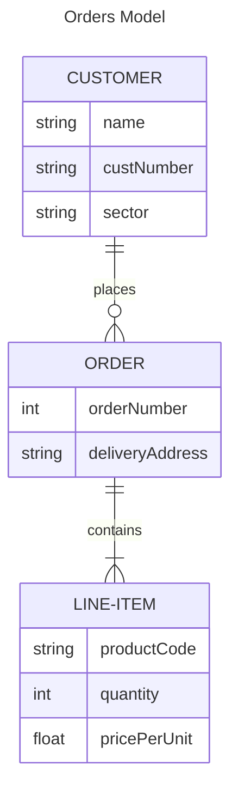
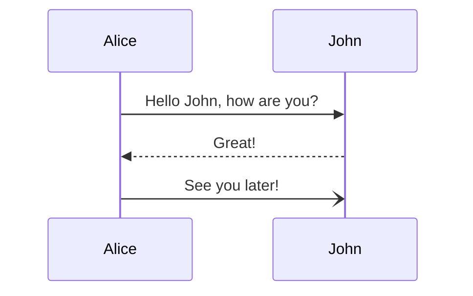

# Plataform Compare

## Features

|                    | Github (SaaS)     | GitLab (SaaS) | GitLab (Self-hosted) | Current     |
|--------------------|-------------------|---------------|----------------------|-------------|
| SCM                | Git               | Git           | Git                  | SVN         |
| CI/CD              | Actions           | CI/CD         | ---                  | Jenkins     |
| Binary Repository  | Packages          | Package       | ---                  | Artifactory |
| Image Registry     | Packages          | Registry      | ---                  | ---         |
| Project Management | Projects / Issues | Plan / Issues | Plan / Issues        | Mantis      |
| Wiki               | Wiki              | Wiki          | Wiki                 | ---         |

## Restrictions

|                      | Github (SaaS) | GitLab (SaaS) | GitLab (Self-hosted) | Current |
|----------------------|---------------|---------------|----------------------|---------|
| Private repositories | Unlimited     | Unlimited     | Unlimited            | ---     |
| Users                | Unlimited     | 5 users/group | Unlimited            | ---     |
| Runners              | ---           | 400 min/month | ---                  | Jenkins |

## Diagrams

### ER

### Sequence

