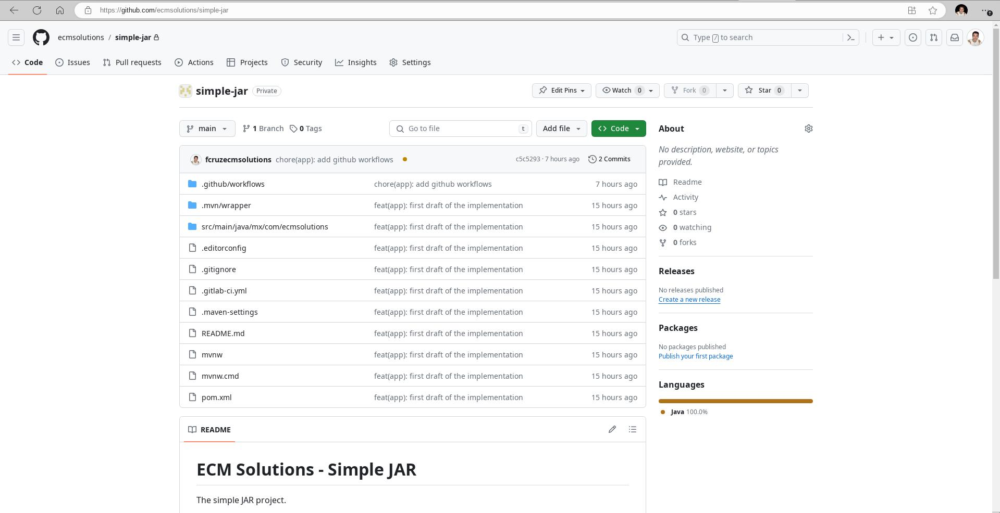

# Plataform Compare

## Features

|                                           | Github (SaaS)     | GitLab (SaaS) | GitLab (Self-hosted) | Current     |
|-------------------------------------------|-------------------|---------------|----------------------|-------------|
| [SCM](#scm)                               | Git               | Git           | Git                  | SVN         |
| [CI/CD](#ci_cd)                           | Actions           | CI/CD         | ---                  | Jenkins     |
| [Binary Repository](#binary_repository)   | Packages          | Package       | ---                  | Artifactory |
| [Image Registry](#image_registry)         | Packages          | Registry      | ---                  | ---         |
| [Project Management](#project_management) | Projects / Issues | Plan / Issues | Plan / Issues        | Mantis      |
| [Wiki](#diagrams)                         | Wiki              | Wiki          | Wiki                 | ---         |

## Restrictions

|                      | Github (SaaS) | GitLab (SaaS) | GitLab (Self-hosted) | Current |
|----------------------|---------------|---------------|----------------------|---------|
| Private repositories | Unlimited     | Unlimited     | Unlimited            | ---     |
| Users                | Unlimited     | 5 users/group | Unlimited            | ---     |
| Runners              | ---           | 400 min/month | ---                  | Jenkins |

## SCM

 - GitLab

 - Github

## CI/CD

 - GitLab

 - Github

## Binary Repository

 - GitLab

 - Github

## Image Registry

- GitLab

- Github

## Project Management

- GitLab

- Github

## Wiki

### Diagrams

#### ER

#### Sequence

